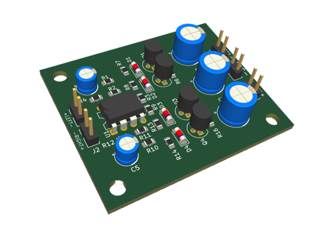
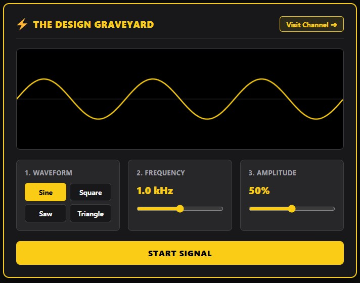

# Description

In this step-by-step video tutorial, you will learn how to simulate electronic circuits in LTspice using a USB-powered audio amplifier as a practical example!  
We cover everything from drawing the schematic to importing third-party SPICE models & analyzing waveforms.   
At the end of the video we will build the amplifier and test the actual physical hardware on the bench. 

### Watch the YouTube video, it will guide you through the process step by step:  
  

Download LTspice Simulator: 
https://www.analog.com/en/resources/design-tools-and-calculators/ltspice-simulator.html

## Content in this GitHub repository:

### LTspice simulation files
The simulation file, schematic symbol and Spice model files.
Unzip and double click the amplifier.asc file to open it in LTspice

### PCB Gerber files for the Amplifier
Send this zip file to your PCB manufacturer to directly order the Amplifier PCB's

### PCB_Material_BOM_Audio_amplifier
Material BOM to build the amplifier

### HTML_Signal_Generator
Single file offline signal generator used in this tutorial.
(AI generated tool)

### PCB_KiCAD_Files_Audio_amplifier
The PCB files made in KiCAD 10 in case you want to re-use or edit them.

